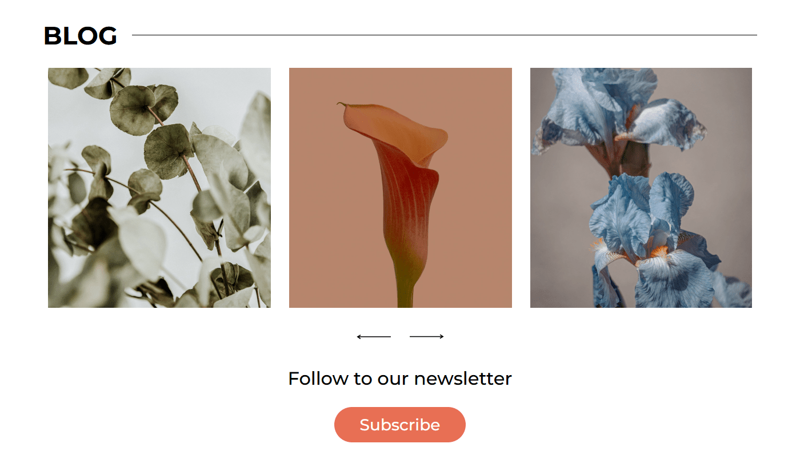

# Single web page for small non existing business

Anemone is my personal take of a group project I previously contributed to. The original project can be viewed [here](https://github.com/amizdalka/anemone-project). In this version, I focused on creating more consistent code within the same technologies.

Taking on the entire project on my own, even with more experience, was indeed a challenge. It took me much longer than I expected, but I'm more than happy with the results. 🥳

## Demo

🔗 [Finished website](https://dag-szad.github.io/Anemone/)
## Tech Stack

🔨 **HTML**, **CSS** with **SASS** and **Java Script**.

## Screenshots

## Roadmap

##### Done:

- ✅ **Responsive Homepage** - The homepage is now responsive for consistent experience across devices.
- ✅ **Custom JavaScript Implementation** - Independently coded JavaScript has been integrated into the design to increase interactivity and functionality.
- ✅ **Optimized Images** - Images have been optimized for web performance, reducing loading times and overall site speed.

##### To Do:

- ❌ **Form Handling** - Implement form functionality to enable user interaction and data submission.
- ❌ **Dark Mode** – Introduce a dark mode option for users who prefer darker colors, improving accessibility and user experience.

## Authors

- Dag
    - [Linkedin](https://www.linkedin.com/in/dagmara-szadkowska-708423255)
    - [GitHub](https://www.github.com/dag-szad)

## Feedback

If you have any feedback, comments, tips, please reach out to me at LinkedIn. 🤗